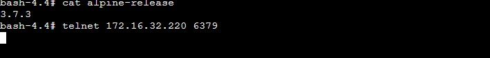
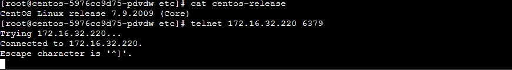
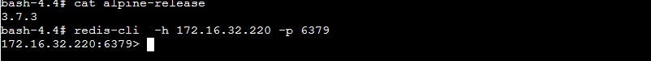

# alpine镜像无法用telnet访问redis

## 问题现象

k8s中如果你启动的镜像操作系统是alpine，容器内无法用telnet连接redis。

## 测试过程

1. redis访问地址172.16.32.220，端口6379
2. 分别用alpine和centos通过telnet测试连接redis
3. 在alpine用redis-cli连接redis，排除alpine网络问题无法访问redis

 

 

 

## 解决方案

从上面的测试结果可以看出，alpine是能正常访问连接redis，然后centos也能telnet访问redis，只有在alpine无法telnet访问redis。

这个问题的原因，当前也没有具体的原因，怀疑是不同操作系统内核包不一样导致的。

这里的解决方案就是尽量避免在alpine通过telnet去测试redis是否正常或者网络是否通。