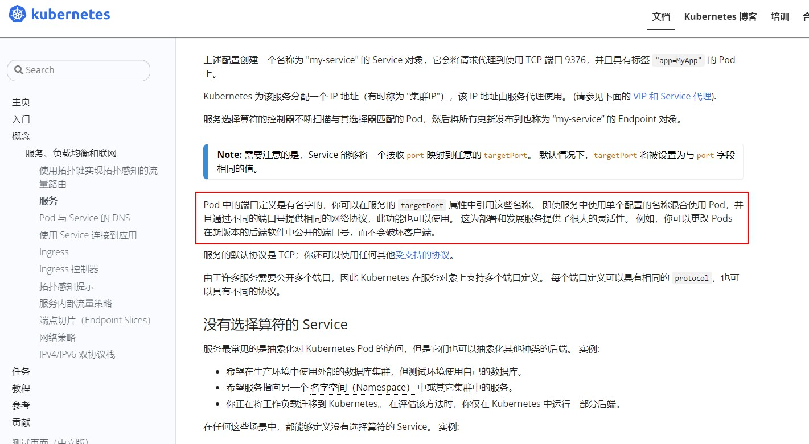

# service绑定后端endpoint异常

## 问题现象

问题现象是k8s集群内通过service访问某个服务报错no healthy upsteam，这里我用一个nginx服务来讲下这个问题

## 排查思路

nginx的deploy和svc对应的yaml如下

```
apiVersion: apps/v1
kind: Deployment
metadata:
  labels:
    k8s-app: nginx
    qcloud-app: nginx
  name: nginx
  namespace: weixnie
spec:
  progressDeadlineSeconds: 600
  replicas: 1
  revisionHistoryLimit: 10
  selector:
    matchLabels:
      k8s-app: nginx
      qcloud-app: nginx
  strategy:
    rollingUpdate:
      maxSurge: 1
      maxUnavailable: 0
    type: RollingUpdate
  template:
    metadata:
      creationTimestamp: null
      labels:
        k8s-app: nginx
        qcloud-app: nginx
    spec:
      containers:
      - image: nginx:latest
        imagePullPolicy: Always
        name: nginx
        resources:
          limits:
            cpu: 500m
            memory: 1Gi
        securityContext:
          privileged: false
        terminationMessagePath: /dev/termination-log
        terminationMessagePolicy: File
      dnsPolicy: ClusterFirst
      imagePullSecrets:
      - name: qcloudregistrykey
      restartPolicy: Always

---
apiVersion: v1
kind: Service
metadata:
  labels:
    k8s-app: nginx
    qcloud-app: nginx
  name: nginx-test
  namespace: weixnie
spec:
  ports:
  - name: 80-80-tcp
    port: 80
    protocol: TCP
    targetPort: http
  selector:
    k8s-app: nginx
    qcloud-app: nginx
  sessionAffinity: None
  type: ClusterIP
```

这里apply后，可以直接通过svc访问下nginx 

```                                                            
[root@VM-55-5-tlinux ~]$ k get svc,pod -o wide  | grep nginx
service/nginx-test                       ClusterIP      10.55.255.43    <none>        80/TCP                                                                    7m46s   k8s-app=nginx,qcloud-app=nginx
pod/nginx-6ccd9d7969-f4rfj            1/1     Running   1          16d   10.55.1.34    172.16.55.5    <none>           <none>

[root@VM-55-5-tlinux ~]# curl 10.55.255.43
no healthy upsteam
```

报错返回的是no healthy upsteam，那后端的pod服务是否正常，直接访问pod看看

```
[root@VM-55-5-tlinux ~]# curl 10.55.1.34
<!DOCTYPE html>
<html>
<head>
<title>Welcome to nginx!</title>
<style>
html { color-scheme: light dark; }
body { width: 35em; margin: 0 auto;
font-family: Tahoma, Verdana, Arial, sans-serif; }
</style>
</head>
<body>
<h1>Welcome to nginx!</h1>
<p>If you see this page, the nginx web server is successfully installed and
working. Further configuration is required.</p>

<p>For online documentation and support please refer to
<a href="http://nginx.org/">nginx.org</a>.<br/>
Commercial support is available at
<a href="http://nginx.com/">nginx.com</a>.</p>

<p><em>Thank you for using nginx.</em></p>
</body>
</html>
```

直接pod正常，说明pod本身是正常的，问题是出在svc的转发上，这里先describe svc看下

```
[root@VM-55-5-tlinux ~]$ k describe svc nginx-test
Name:              nginx-test
Namespace:         weixnie
Labels:            k8s-app=nginx
                   qcloud-app=nginx
Annotations:       <none>
Selector:          k8s-app=nginx,qcloud-app=nginx
Type:              ClusterIP
IP:                10.55.255.43
Port:              80-80-tcp  80/TCP
TargetPort:        http/TCP
Endpoints:         <none>
Session Affinity:  None
Events:
  Type    Reason                Age   From                Message
  ----    ------                ----  ----                -------
  Normal  EnsuringService       11m   service-controller  Deleted Loadbalancer
  Normal  EnsureServiceSuccess  11m   service-controller  Service Sync Success. RetrunCode: S2000
```

从describe的信息可以发现，Endpoints是空的，为什么svc没绑定成功到endpoint呢？这里端口设置没问题，Selector的label和pod也是能匹配上的。

这里又仔细的看了下svc的yaml配置，发现TargetPort是用的http这个名称，而不是写的端口，翻了下官网文档

 

从文档说明来看，如果svc的TargetPort配置成非端口，用名称，需要先在deploy里面定义才行，这里deploy是没有定义这个端口名称的，所以svc配置成名称，导致svc无法正确选择后端endpoint。

## 解决方案

上面分析了，svc没绑定后端endpoint是以为TargetPort设置成了名称，那么这里解决方案就有2个

1. 修改svc的TargetPort的配置，改成端口
2. 在deploy里面定义下端口的名称

