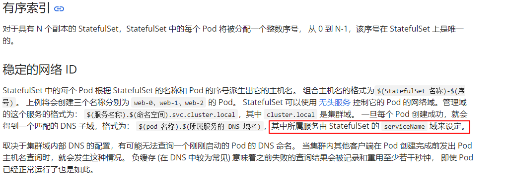

# StatefulSet类型pod域名无法解析

## 问题现象

k8s集群中创建了一个StatefulSet的工作负载，然后创建了一个headless类型的service，具体的yaml如下

```
apiVersion: apps/v1
kind: StatefulSet
metadata:
  labels:
    k8s-app: headles-svc-test
    qcloud-app: headles-svc-test
  name: headles-svc-test
  namespace: weixnie
spec:
  replicas: 1
  revisionHistoryLimit: 10
  selector:
    matchLabels:
      k8s-app: headles-svc-test
      qcloud-app: headles-svc-test
  serviceName: ""
  template:
    metadata:
      labels:
        k8s-app: headles-svc-test
        qcloud-app: headles-svc-test
    spec:
      containers:
      - image: nginx
        imagePullPolicy: Always
        name: headles-svc-test
        resources:
          limits:
            cpu: 500m
            memory: 1Gi
          requests:
            cpu: 250m
            memory: 256Mi
        securityContext:
          privileged: false
        terminationMessagePath: /dev/termination-log
        terminationMessagePolicy: File
      dnsPolicy: ClusterFirst
      imagePullSecrets:
      - name: qcloudregistrykey
      restartPolicy: Always
      schedulerName: default-scheduler
      securityContext: {}
      terminationGracePeriodSeconds: 30

---
apiVersion: v1
kind: Service
metadata:
  labels:
    k8s-app: headles-svc-test
    qcloud-app: headles-svc-test
  name: headles-svc-test
  namespace: weixnie
spec:
  clusterIP: None
  clusterIPs:
  - None
  ports:
  - name: 80-80-tcp
    port: 80
    protocol: TCP
    targetPort: 80
  selector:
    k8s-app: headles-svc-test
    qcloud-app: headles-svc-test
  sessionAffinity: None
  type: ClusterIP
```


但是当我在pod里面测试通过pod的域名访问nginx服务时候，提示找不到这个域名

```
bash-5.1# ping headles-svc-test-0.headles-svc-test.weixnie.svc.cluster.local
ping: bad address 'headles-svc-test-0.headles-svc-test.weixnie.svc.cluster.local'
bash-5.1# nslookup headles-svc-test-0.headles-svc-test.weixnie.svc.cluster.local
Server:         10.55.255.31
Address:        10.55.255.31:53

** server can't find headles-svc-test-0.headles-svc-test.weixnie.svc.cluster.local: NXDOMAIN

** server can't find headles-svc-test-0.headles-svc-test.weixnie.svc.cluster.local: NXDOMAIN
```

## 排查思路

svc是headless类型，并且域名也是全域名，配置都是正常到，符合规范，为什么不能解析不了呢，首先我们这里试试解析下svc的域名试试，看下是否可以解析

```
bash-5.1# nslookup headles-svc-test.weixnie.svc.cluster.local
Server:         10.55.255.31
Address:        10.55.255.31:53

Name:   headles-svc-test.weixnie.svc.cluster.local
Address: 10.55.2.61
```

解析service的名称是正常的，但是加上pod的名称就不行了。这里肯定是哪里配置不对，这里仔细看了下官网文档介绍<https://kubernetes.io/zh-cn/docs/concepts/workloads/controllers/statefulset/>

 

这里说明了pod的域名是由serviceName决定的，但是我们的yaml里面serviceName配置的是空。这里要想通过{pod_name}.{svc_name}.{ns}.svc.cluster.local域名访问到pod，statefulset的spec.serviceName需要配置成headless类型svc的名称才行。

## 解决方案

这里修改yaml，serviceName配置成headless类型svc的名称

```
spec:
  replicas: 1
  revisionHistoryLimit: 10
  selector:
    matchLabels:
      k8s-app: headles-svc-test
      qcloud-app: headles-svc-test
  serviceName: headles-svc-test
```

