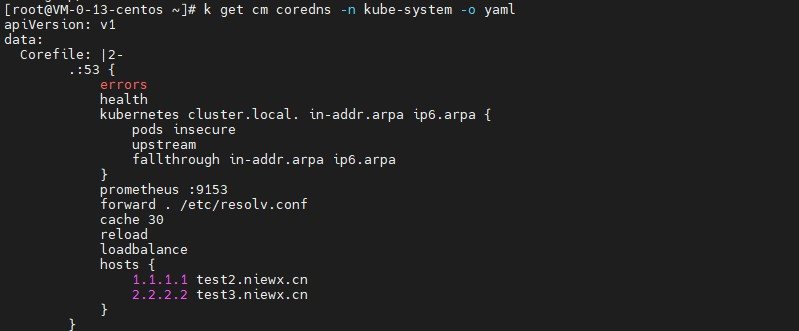
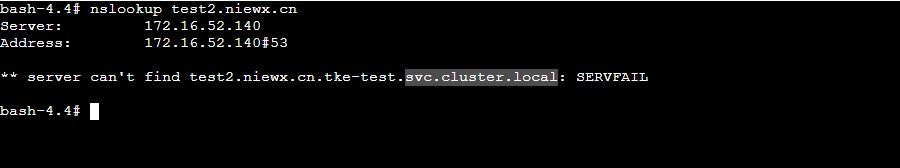
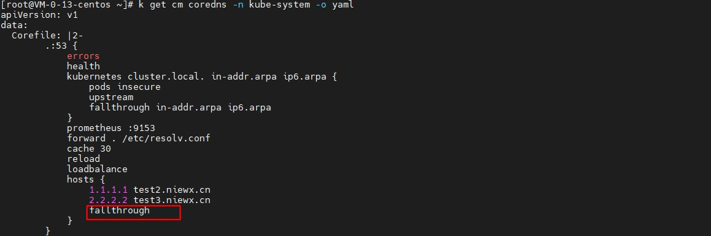
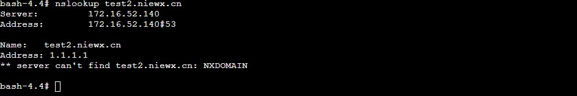

# k8s集群内pod内无法正确解析coredns中的hosts配置

## 问题现象

k8s的coredns中进行了hosts的全局域名解析配置，但是在容器内解析对应的域名发现走的是k8s集群内部的svc.cluster.local域名，并没有解析到配置的hosts上

 

 

## 排查思路

这边首先测试了下在节点上配置了hosts是能正常解析，并且将pod的dns策略改成default不走coredns也是能正常解析，那么为什么经过coredns就不行了呢？这里看了下coredns中配置hosts的方式也没有问题。

这里查看了下coredns的官方文档hosts配置<https://coredns.io/plugins/hosts/#description>，发现我配置的hosts插件中没有设置fallthrough这个字段，根据文档的说明

fallthrough If zone matches and no record can be generated, pass request to the next plugin. If [ZONES…] is omitted, then fallthrough happens for all zones for which the plugin is authoritative. If specific zones are listed (for example and ), then only queries for those zones will be subject to fallthrough.in-addr.arpaip6.arpa

如果区域匹配并且无法生成记录，fallthrough则将请求传递给下一个插件，如果不设置，则不会继续找其他插件进行解析。

If you want to pass the request to the rest of the plugin chain if there is no match in the hosts plugin, you must specify the option.fallthrough

如果在hosts插件中没有匹配项的情况下要将请求传递给插件链的其余部分，则必须指定fallthrough，所以这里大概就是fallthrough没有设置导致的。

## 解决方案

coredns的hosts插件中加上fallthrough配置，然后重建coredns的pod即可。

