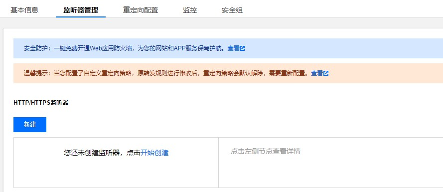

# 无法通过负载均衡类型ingress访问后端服务

## 问题现象

tke集群部署了一个nginx服务，并通过一个负载均衡类型的ingress暴露域名提供访问，但是通过域名无法访问到后端nginx服务。

## 排查思路

+ 首先查看了ingress对应的clb监听后端是否正常，发现后端监听没有创建。

 

+ 没有成功创建监听说明ingress同步规则到clb失败，这时候查看ingress事件是否有报错，看了下事件也没有具体报错。

+ 事件不能看出来，这时候再去查看下ingress-controller日志，对应的pod是部署在集群内kube-system命名空间下的l7-lb-controller这个deploy，根据ingress名称搜下日志发现有报错，从报错中基本可以看出问题所在，一般主要存在下面几种情况。

1.后端的Service类型不匹配

```
sync ingress(coding01/nginx) error!err:Ingress Sync ClientError. ErrorCode: E4047 Details: Ingress: coding01/nginx. Service(coding01/nginx) is no able to be the backend of ingress. NodePort service or LoadBalancer service is support for ingress. OriginError: 
```

2.ingress后端的svc被删除

```
2021-12-22T17:23:35.35178018+08:00 W1222 09:23:35.351592       1 controller.go:2729] sync ingress(coding01/nginx.) error!err:Ingress Sync ClientError. ErrorCode: E4041 Details: Ingress: coding01/nginx. Service(xxx/xxxx) is not found. OriginError: 
```

## 解决方案

1. 如果是service类型不匹配，需要将后端service为odePort或者LoadBalancer才行，这个问题只会出现在用yaml创建ingress，如果是控制创建的ingress是无法选择后端ClusterIP类型的service。

2. ingress后端svc被删除，需要将被删除的svc对应的ingress规则去掉，或者将svc重新创建好。


