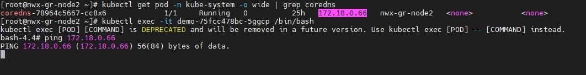

# TKE集群内pod无法解析service name

## 问题现象

tke集群内的pod无法解析service name到cluserip上，服务之间访问出现异常。

本次问题现象就是在demo的pod无法解析同命名空间下的nginx这个service name，导致demo访问nginx异常。

 

## 排查思路

k8s集群内解析service name都是通过coredns来解析的，pod内会去请求coredns的service然后请求coredns的pod来解析service name，原理是这样，现在无法解析service name，是不是访问coredns的pod不通呢？

 

进入demo直接访问coredns的pod，发现ping都不通，问题就出在这里，demo为什么无法访问coredns呢？要么就是coredns异常了，要么就是集群网络哪里有异常，这里看了下coredns的状态和日志都是正常的。

 

那说明是集群网络哪里有问题了，这里首先检查下节点的安全组，看下是否有问题。

查看了下安全组的入站和出站规则，出站都是放通，入站的话有放通vpc的网段，但是容器网段只放通了一个小的网段。

查看集群的容器网段发现是16的掩码，但是安全组只放通了26的掩码，这里安全组肯定是有问题。

## 解决方案

上面我们排查到了问题是出在安全组，这里我们将安全改下，放通全部容器网段看看。

放通全部容器网段后，再进入pod测试，发现可以正常解析域名了，并且也能正常访问coredns了。

集群内pod无法解析service-name问题就是节点安全组导致，入站没有放通全部容器网段导致的。

这里顺便解释下为什么要安全组放通容器网段，tke集群内默认部署了一个ip-masq-agent组件，这个组件的作用是决定pod访问哪些网段不做nat，默认配置的是容器网段和vpc网段，也就是说demo这个pod访问coredns不会做nat，coredns看到的是demo真实的客户端ip，也就是demo的pod-ip，当coredns和demo不在一个节点，就会跨节点访问，节点安全组没有放通demo所在的网段，导致demo无法访问coredns，最终在pod内的现象就是无法解析service name。

